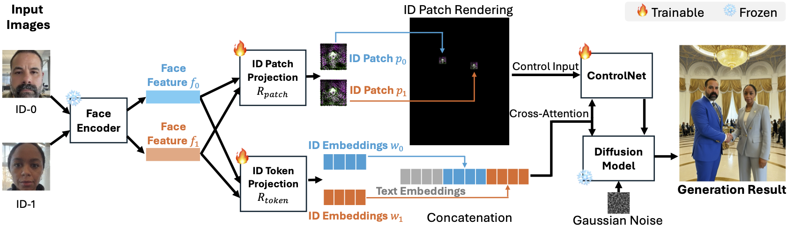

<!-- # magic-edit.github.io -->
<p align="center">
  <h2 align="center"> [CVPR 2025] ID-Patch: Robust ID Association for Group Photo Personalization</h2>
  <p align="center">
                <a href="https://damon-demon.github.io">Yimeng Zhang</a><sup>1,2,*</sup>,
                <a href="https://tiancheng-zhi.github.io">Tiancheng Zhi</a><sup>1</sup>,
                <a href="https://www.jingliu.net">Jing Liu</a><sup>1</sup>,
                <a href="https://ssangx.github.io">Shen Sang</a><sup>1</sup>,
                <a href="https://liming-jiang.com">Liming Jiang</a><sup>1</sup>,
                <a href="https://scholar.google.com/citations?user=0TIYjPAAAAAJ&hl=en">Qing Yan</a><sup>1</sup>,
                <a href="https://lsjxjtu.github.io">Sijia Liu</a><sup>2</sup>,
                <a href="http://linjieluo.com/">Linjie Luo</a><sup>1</sup>
    <br>
    &nbsp;  <sup>1</sup>ByteDance Inc.,  <sup>2</sup>Michigan State University 
    <br>
    <small>&nbsp;  <sup>*</sup>Work done during internship at ByteDance. </small>
    <br>
    <br>
        <a href="https://byteaigc.github.io/ID-Patch/"></a> &ensp;
        <a href="https://arxiv.org/abs/2411.13632"></a> &ensp;
        <a href="https://huggingface.co/ByteDance/ID-Patch"></a> &ensp;
        <a href="https://huggingface.co/spaces/ByteDance/ID-Patch-SDXL"></a> &ensp;
    <br>
  </p>
  
  <table align="center">
    <tr>
    <td>
      
    </td>
    </tr>
  </table>

## ID-Patch: Build Identity-to-Position Association
To address ID leakage and the linear increase in generation time with the number of identities, we propose **_ID-Patch_**, a novel method for robust identity-to-position association. From the same facial features, we generate both an **_ID patch_**—placed on the conditional image for precise spatial control—and **_ID embeddings_**, which are fused with text embeddings to enhance identity resemblance.

<table align="center">
    <tr>
    <td>
      
    </td>
    </tr>
  </table>

## Environment Setup
Note: Python 3.9 and CUDA 12.2 are required.
```shell
conda create -n idp python=3.9
conda activate idp
pip install -r requirements.txt
```

Download models from https://huggingface.co/ByteDance/ID-Patch, and put them under `models/` folder.
```shell
git lfs install
git clone https://huggingface.co/ByteDance/ID-Patch
```

## Demo
```shell
python demo.py
```
| Argument | Description |
|----------|-------------|
| `--pose_image_path` | Path to the pose image used for conditioning the generation. Default: `data/poses/example_pose.png` |
| `--subject_dir` | Directory containing subject identity images. Each image should represent one person. Default: `data/subjects` |
| `--subjects` | Comma-separated list of subject image filenames (e.g., `exp_man.jpg,exp_woman.jpg`). The order corresponds to their placement from **left to right** in the generated image. |
| `--prompt` | Text prompt describing the scene to be generated. This guides the overall content and style of the output image. |
| `--base_model_path` | Path to the base diffusion model to be used for generation. Default: `RunDiffusion/Juggernaut-X-v10` |
| `--output_dir` | Directory where the generated images will be saved. Default: `results` |
| `--output_name` | Filename prefix for the generated image(s). Default: `exp_result` |

## Disclaimer
Our released HuggingFace model differs from the paper’s version due to training on a different dataset.

## License
```
Copyright 2024 Bytedance Ltd. and/or its affiliates

Licensed under the Apache License, Version 2.0 (the "License");
you may not use this file except in compliance with the License.
You may obtain a copy of the License at

    http://www.apache.org/licenses/LICENSE-2.0

Unless required by applicable law or agreed to in writing, software
distributed under the License is distributed on an "AS IS" BASIS,
WITHOUT WARRANTIES OR CONDITIONS OF ANY KIND, either express or implied.
See the License for the specific language governing permissions and
limitations under the License.
```

## Citation
If you find this code useful for your research, please cite us via the BibTeX below.
```BibTeX
@InProceedings{zhang2025idpatch,
    author    = {Zhang, Yimeng and Zhi, Tiancheng and Liu, Jing and Sang, Shen and Jiang, Liming and Yan, Qing and Liu, Sijia and Luo, Linjie},
    title     = {ID-Patch: Robust ID Association for Group Photo Personalization},
    booktitle = {Proceedings of the IEEE/CVF Conference on Computer Vision and Pattern Recognition (CVPR)},
    month     = {June},
    year      = {2025}
}
```
