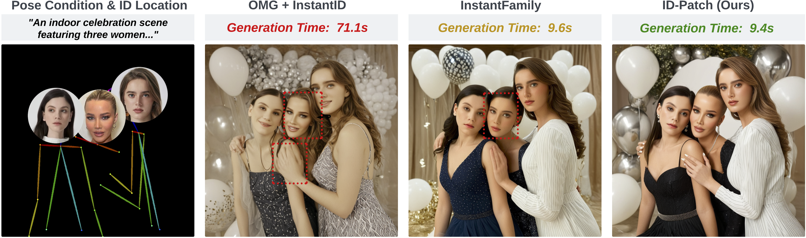

<!-- # magic-edit.github.io -->
<p align="center">
  <h2 align="center">ID-Patch: Robust ID Association for Group Photo Personalization</h2>
  <p align="center">
                <a href="https://damon-demon.github.io">Yimeng Zhang</a><sup>1,2,*</sup>,
                <a href="https://tiancheng-zhi.github.io">Tiancheng Zhi</a><sup>1</sup>,
                <a href="https://www.jingliu.net">Jing Liu</a><sup>1</sup>,
                <a href="https://ssangx.github.io">Shen Sang</a><sup>1</sup>,
                <a href="https://liming-jiang.com">Liming Jiang</a><sup>1</sup>,
                <a href="https://scholar.google.com/citations?user=0TIYjPAAAAAJ&hl=en">Qing Yan</a><sup>1</sup>,
                <a href="https://lsjxjtu.github.io">Sijia Liu</a><sup>2</sup>,
                <a href="http://linjieluo.com/">Linjie Luo</a><sup>1</sup>
    <br>
    &nbsp;  <sup>1</sup>ByteDance Inc.,  <sup>2</sup>Michigan State University 
    <br>
    <small>&nbsp;  <sup>*</sup>Work done during internship at ByteDance. </small>
    <br>
    <br>
        <a href="https://arxiv.org/abs/2411.13632"></a>
        <a href='https://byteaigc.github.io/ID-Patch/'></a>
    <br>
  </p>
  
  <table align="center">
    <tr>
    <td>
      
    </td>
    </tr>
  </table>

## Installation
Note: Python 3.9 and CUDA 12.2 are required.
```shell
pip install -r requirements.txt
```

Download models from https://huggingface.co/ByteDance/ID-Patch, and put them under `models/` folder.

## Demo
```shell
python demo.py
```

## Disclaimer
This model is different from the model used in the paper as it is trained using different data.

## License
```
Copyright 2024 Bytedance Ltd. and/or its affiliates

Licensed under the Apache License, Version 2.0 (the "License");
you may not use this file except in compliance with the License.
You may obtain a copy of the License at

    http://www.apache.org/licenses/LICENSE-2.0

Unless required by applicable law or agreed to in writing, software
distributed under the License is distributed on an "AS IS" BASIS,
WITHOUT WARRANTIES OR CONDITIONS OF ANY KIND, either express or implied.
See the License for the specific language governing permissions and
limitations under the License.
```

## Citation
If you find this code useful for your research, please cite us via the BibTeX below.
```BibTeX
@article{zhang2024idpatch,
        title={ID-Patch: Robust ID Association for Group Photo Personalization},
        author={Zhang, Yimeng and Zhi, Tiancheng and Liu, Jing and Sang, Shen and Jiang, Liming and Yan, Qing and Liu, Sijia and Luo, Linjie},
        journal={arXiv preprint arXiv:2411.13632},
        year={2024}
}
```